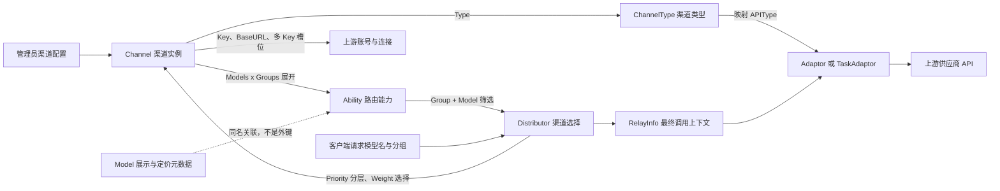
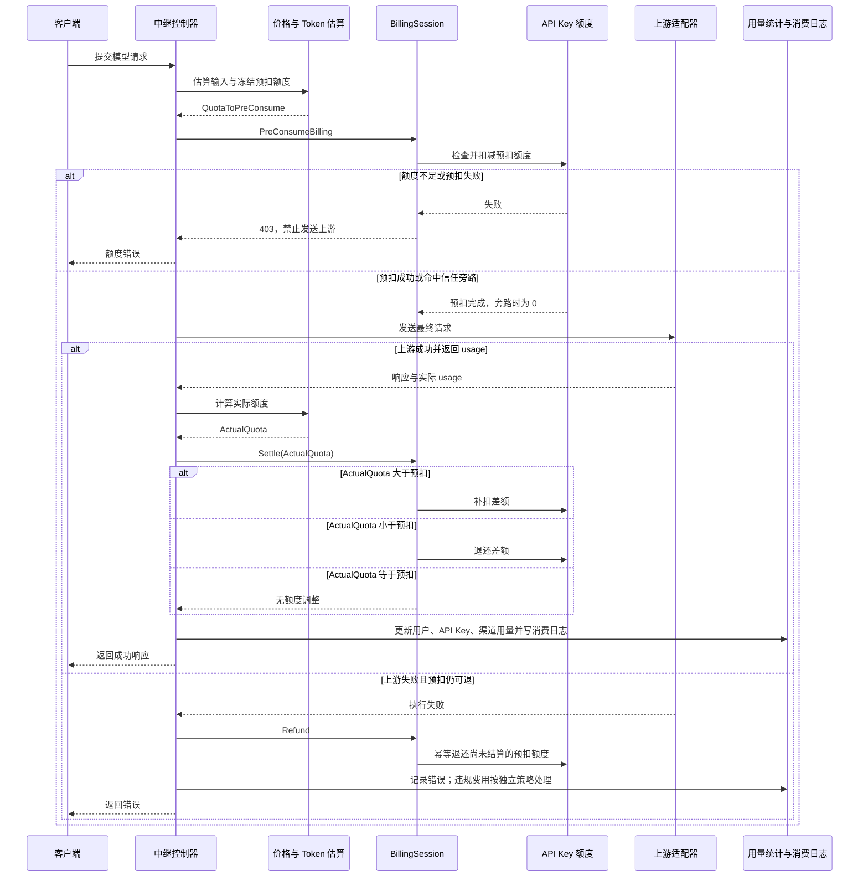

# 项目模块与业务关系分析报告

生成日期：2026-07-02
更新日期：2026-07-31

## 结论摘要

本项目是一个 AI API 网关与 AI 资产管理系统。业务主线可以概括为：

```text
用户 -> API 令牌 -> 请求模型 -> 能力路由 -> 渠道 -> 上游供应商/模型服务
  |        |          |          |       |
  |        |          |          |       +-> 上游余额、密钥、多 Key、状态、自动禁用
  |        |          |          +-> 分组、模型、优先级、权重
  |        |          +-> 模型资产、价格、端点类型、展示元数据
  |        +-> 令牌额度、模型限制、IP 限制、分组
  +-> 日志、权限、历史额度字段兼容
```

其中，“渠道”和“上游供应商/适配器”不是同一个概念；模型资产中的供应商元数据已降级为历史兼容层：

- 渠道：实际可调用的上游接入配置，包含上游密钥、基础地址、渠道类型、可用模型、可用分组、优先级、权重、状态、多 Key、参数覆盖等。一个上游提供方可以配置多个渠道。
- 上游供应商/适配器：由 `Channel.Type`、relay adaptor、base URL 和密钥共同决定，直接参与请求转发。
- 模型资产供应商元数据：旧版模型目录展示归属字段；当前默认前端、定价页、排行榜和公开管理 API 已移除该模块，仅保留数据库表/字段兼容旧部署。
- 模型：用户请求和渠道能力匹配的核心字符串，同时也有独立的模型元数据表用于描述、图标、标签和端点。
- 能力：`Ability` 是“某分组下某模型可以由某渠道承载”的路由关系表，是渠道调度的核心连接点。

## 核验来源

本报告已核验以下入口：

- 项目约定：`AGENTS.md`、`CLAUDE.md`、`README.zh_CN.md`
- 路由入口：`router/api-router.go`、`router/channel-router.go`、`router/relay-router.go`、`router/dashboard.go`、`router/authz-router.go`
- 核心模型：`model/channel.go`、`model/ability.go`、`model/token.go`、`model/user.go`、`model/model_meta.go`、`model/vendor_meta.go`、`model/log.go`、`model/topup.go`、`model/subscription.go`、`model/task.go`
- 中继流程：`middleware/auth.go`、`middleware/distributor.go`、`controller/relay.go`、`relay/relay_adaptor.go`、`service/channel_select.go`、`service/billing.go`、`service/billing_session.go`
- 前端模块：`web/default/src/routes/`、`web/default/src/features/`

## 模块清单

### 1. 用户与认证模块

主要对象：

- `User`：平台用户，包含用户名、邮箱、角色、状态、分组、历史额度字段、已用额度、邀请、第三方账号绑定字段、用户设置等。
- `PasskeyCredential`、`TwoFA`、`TwoFABackupCode`：通行密钥和二次验证。
- `CustomOAuthProvider`、`UserOAuthBinding`：自定义 OAuth 提供方和用户绑定关系。

主要职责：

- 面向前端后台提供登录、注册、OAuth 登录、2FA、Passkey、个人资料、用户管理。
- 为管理 API 提供 `UserAuth`、`AdminAuth`、`RootAuth` 三层会话鉴权。
- 为系统管理访问提供用户 `AccessToken`。

业务关系：

- 一个用户可以创建多个 API 令牌。
- 一个用户属于一个默认业务分组。
- 用户可以有 API 令牌、调用日志和历史额度数据；钱包、充值、兑换码和订阅购买入口已从当前业务入口移除。
- 管理员/Root 用户通过角色和权限系统访问管理模块。

### 2. API 令牌模块

主要对象：

- `Token`：用户对外调用 API 的凭证。

关键字段：

- `UserId`：令牌归属用户。
- `Key`：真实 API Key。
- `RemainQuota`、`UnlimitedQuota`、`UsedQuota`：令牌额度。
- `Group`：令牌使用的业务分组，可为 `auto`。
- `ModelLimitsEnabled`、`ModelLimits`：令牌可调用模型限制。
- `AllowIps`：IP 白名单。
- `CrossGroupRetry`：自动分组场景下是否跨分组重试。

业务关系：

- 客户端请求 `/v1/*`、`/mj/*`、`/suno/*` 等中继接口时，先通过令牌认证。
- 令牌会限制模型、额度、IP、过期时间和使用分组。
- 令牌的分组会影响后续可选渠道和计费倍率。

### 3. 分组与权限模块

主要对象：

- 用户分组：`User.Group`
- 令牌分组：`Token.Group`
- 渠道分组：`Channel.Group`
- 能力分组：`Ability.Group`
- 预填组：`PrefillGroup`
- 管理权限：`AuthzRole`、`CasbinRule`

主要职责：

- 将用户、令牌、渠道、模型能力和倍率配置按分组隔离。
- `auto` 分组支持根据用户分组展开为多个候选分组。
- `AuthzRole` 和权限定义用于细分管理员能力，例如渠道读、写、敏感写、操作等。

业务关系：

- 请求选择渠道时，必须同时满足“令牌使用分组 + 请求模型 + 渠道能力”。
- 分组倍率参与最终计费。
- 管理员接口通过角色和权限控制后台操作范围。

### 4. 渠道模块

主要对象：

- `Channel`：上游接入配置。
- `ChannelInfo`：多 Key 模式和 Key 状态。

关键字段：

- `Type`：渠道类型，例如 OpenAI、Anthropic、Gemini、Azure、AWS、OpenRouter、Ollama、Codex、Advanced Custom 等。
- `Key`：上游 API Key 或多 Key。
- `BaseURL`：上游基础地址。
- `Models`：该渠道支持的模型列表。
- `Group`：该渠道开放给哪些分组。
- `Status`：启用、禁用、自动禁用等。
- `Priority`、`Weight`：调度优先级和同优先级内权重。
- `ModelMapping`：模型名映射。
- `OtherSettings`、`Setting`、`ParamOverride`、`HeaderOverride`：渠道额外行为配置。
- `Tag`：渠道批量管理标签。

主要职责：

- 表示平台连接某个上游供应商或兼容 API 的一份实际账号/连接配置。
- 维护上游 Key、模型、分组、状态、权重、余额、测试结果和自动禁用。
- 通过 `AddAbilities` / `UpdateAbilities` 生成或刷新能力路由关系。

业务关系：

- 一个渠道可以支持多个模型、多个分组。
- 一个模型在同一分组下可以由多个渠道承载。
- 同一供应商通常会配置多个渠道，用于不同 Key、区域、代理、模型集合或优先级。
- 渠道不直接等于供应商，渠道是运行时资源，供应商是展示和元数据归属。

### 5. 能力路由模块

主要对象：

- `Ability`

关键字段：

- `Group`
- `Model`
- `ChannelId`
- `Enabled`
- `Priority`
- `Weight`
- `Tag`

主要职责：

- 维护“某分组 + 某模型 -> 可用渠道集合”的路由关系。
- 支持按优先级重试，按权重随机选择。
- 支持内存缓存 `group2model2channels` 加速选择。

业务关系：

- 渠道增删改、状态变更、模型变更后，需要刷新能力和渠道缓存。
- 请求进入中继后，调度器基于 `Ability` 选择满足条件的渠道。
- 定价页和模型列表也会使用能力信息判断模型在哪些分组、端点、渠道中可用。

### 6. 模型资产模块（供应商元数据兼容层）

主要对象：

- `Model`：模型元数据。
- `Vendor`：历史供应商元数据兼容表。当前不提供默认前端入口和 `/api/vendors/*` 管理 API，不再用于定价页、排行榜和模型列表展示。

`Model` 关键字段：

- `ModelName`
- `VendorID`：历史兼容字段，不对外 JSON 序列化。
- `Description`
- `Icon`
- `Tags`
- `Endpoints`
- `Status`
- `SyncOfficial`
- `NameRule`

`Vendor` 兼容字段：

- `Name`
- `Description`
- `Icon`
- `Status`

主要职责：

- 为价格页、模型管理、模型目录等提供模型展示元数据。
- 通过 `NameRule` 支持精确、前缀、包含、后缀匹配。
- 通过 `Endpoints` 可覆盖模型支持端点类型。

业务关系：

- 模型元数据不再通过默认前端维护供应商归属；旧 `VendorID` 数据仅作兼容保留。
- 模型是否能实际调用，最终仍取决于 `Ability` 和可用渠道。
- `Model.BoundChannels` 是运行时根据 `Ability + Channel` 查询出的展示信息，不是数据库外键。
- 模型管理列表只展示有启用 `Ability` 覆盖到的模型元数据；无启用能力的内置或历史模型不会出现在列表中。
- 新增渠道时会将渠道模型列表与 `models` 表对比，缺失的精确模型名会自动写入模型管理，默认启用且不覆盖已有模型配置。

### 7. 中继与供应商适配模块

主要入口：

- OpenAI 兼容：`/v1/chat/completions`、`/v1/responses`、`/v1/images/*`、`/v1/audio/*`、`/v1/embeddings`
- Claude 兼容：`/v1/messages`
- Gemini 兼容：`/v1beta/models/*`
- Realtime：`/v1/realtime`
- Midjourney：`/mj/*`
- Suno：`/suno/*`
- 视频：`/v1/videos/*`、`/kling/v1/*`、`/jimeng/*`

主要对象：

- `RelayInfo`
- `RelayFormat`
- `ChannelType`
- `APIType`
- `Adaptor`
- `TaskAdaptor`

主要流程：

1. `TokenAuth` 验证 API 令牌并加载用户、令牌、分组、额度上下文。
2. `Distribute` 从请求体或路径解析模型。
3. 检查令牌模型限制。
4. 根据分组、模型、请求路径、渠道亲和缓存选择渠道。
5. 生成 `RelayInfo`。
6. 做敏感词检查、token 预估、价格计算和预扣费。
7. 根据 `ChannelType -> APIType -> Adaptor` 调用对应上游适配器。
8. 成功后按实际 usage 结算；失败后退款、记录错误、按策略重试或自动禁用渠道。

业务关系：

- `Channel.Type` 决定使用哪个供应商适配器。
- 多个不同渠道类型可能共用 OpenAI 协议适配器，例如 OpenRouter、Xinference 等。
- 任务类模型使用 `TaskAdaptor`，普通同步/流式接口使用 `Adaptor`。
- Advanced Custom 渠道会额外按请求路径匹配配置路由。

### 8. 计费与额度模块

主要对象：

- `Token`：API Key 自身额度、无限额度标记和已用额度。
- `BillingSession`：单次请求计费生命周期。
- `TopUp`、`Redemption`、`SubscriptionPlan`、`SubscriptionOrder`、`UserSubscription`、`SubscriptionPreConsumeRecord`：历史兼容表，当前默认业务入口已移除。

主要职责：

- 请求计费：统一通过 `BillingSession` 处理 API Key 额度预扣、补扣、退还和结算。
- API Key 限额：有限额令牌会在请求前检查并预扣额度；无限额度令牌跳过额度不足判断。
- 用户余额：请求链路不再检查用户钱包余额，也不再对用户 `Quota` 做消费扣减或退款。
- 支付网关：充值、支付网关、兑换码和订阅购买相关前后端入口已移除；历史数据表保留用于兼容旧部署和历史记录。

业务关系：

- 单次请求的可用额度以 API Key 自身额度为准。
- 用户 `UsedQuota`、令牌 `UsedQuota`、渠道用量、日志和聚合统计继续按请求消耗记录，不依赖钱包充值入口。
- 计费倍率来自模型倍率、分组倍率、补全倍率、缓存倍率、音频/图片倍率，部分模型支持表达式计费。
- 模型基础固定价格来自模型自身设置中的 `base_price` 字段，用于按次、按请求、按任务或按动作收费的模型，例如 Midjourney 动作、Suno、图片生成、视频任务、部分 TTS 等；它不是供应商价格，也不按供应商归属计算。
- `base_price` 表示乘以分组倍率之前的模型基础价格。基础公式是 `base_price * QuotaPerUnit * GroupRatio`，任务类业务还可叠加适配器估算出的时长、分辨率、数量等 `OtherRatios`。
- `base_price` 在“模型管理 -> 新增/编辑模型 -> Per-request (fixed price)”里配置。模型管理的顶层 `Pricing / 定价` 页签只管理模型倍率、表达式计费、工具价格和上游价格同步，不再保存固定基础价。
- 后端计费读取顺序是：模型自身 `base_price` 优先，其次兼容旧 `options.ModelPrice`，最后使用后端 `defaultModelPrice` 默认基础价。`options.ModelPrice` 保留为历史部署 fallback，新页面不再作为主要配置入口。
- 后端初始化会将 `defaultModelRatio` 与 `defaultModelPrice` 中的默认模型补入模型管理；其中 `defaultModelPrice` 内置固定价会写入模型自身 `base_price`。该过程只补缺失模型或空 `base_price`，不会覆盖管理员已有的模型名称、状态、匹配规则或已设置的 `base_price`。
- 请求失败时，API Key 预扣额度会尽量退还；违规费用可按策略扣除并继续写入日志统计。

### 9. 日志、数据看板与排行榜模块

主要对象：

- `Log`
- `QuotaData`
- `FlowQuotaData`
- `PerfMetric`

主要职责：

- `Log` 记录消费、管理操作、系统事件、错误、退款、登录等。
- `QuotaData` 按小时聚合用户、模型、分组、令牌、渠道、节点的调用量和额度消耗。
- `PerfMetric` 记录性能指标。
- 排行榜和价格页使用模型与用量聚合数据展示趋势。

业务关系：

- 每次中继成功或失败都会写入对应消费或错误日志。
- 用户可看自己的日志，管理员可看全局日志。
- 可选独立日志库，日志数据库支持 ClickHouse。

### 10. 异步任务与媒体生成模块

主要对象：

- `Task`
- `Midjourney`

主要支持：

- Midjourney
- Suno
- Sora / OpenAI 视频
- Kling
- Jimeng
- Vidu
- Doubao / VolcEngine
- Gemini / Vertex 视频
- MiniMax / Hailuo

主要职责：

- 提交异步任务，保存上游任务 ID、公开任务 ID、状态、进度、结果、失败原因。
- 轮询上游任务状态。
- 在任务完成或失败时进行退款、补扣和日志记录。

业务关系：

- 任务提交仍然使用令牌、分组、能力路由和渠道选择。
- `TaskPrivateData` 会保存上游真实任务 ID、结果 URL、计费来源、订阅 ID、令牌 ID、节点名和计费上下文。
- 任务查询接口通常不重新选择渠道，而是根据任务记录回查原渠道或任务信息。

### 11. 系统设置与运营模块

主要对象：

- `Option`
- `Setup`
- 各 `setting/*` 配置包
- `SystemTask`
- `SystemTaskLock`
- `SystemInstance`

主要职责：

- 管理站点信息、法律文本、注册登录、OAuth、倍率、模型、内容安全、性能、渠道亲和、请求限制等。
- 系统初始化和安装状态。
- 后台系统任务，例如日志清理。
- 系统实例上报和集群节点信息。

业务关系：

- 设置影响中继、安全、计费、前端显示和运维行为。
- Root 用户可以修改全局设置。
- 部分后台操作会通过系统任务异步执行。

### 12. 模型部署集成模块

主要入口：

- `/api/deployments/*`

主要职责：

- 当前接入 io.net，用于查看、创建、更新、延长、删除部署，查询硬件、位置、容器、日志和价格估算。
- 配置由 `model_deployment.ionet.*` 相关选项控制。

业务关系：

- 这是管理侧外部资源编排模块，不直接参与普通 API 中继调度。
- 部署出的模型如果要纳入中继，需要再通过渠道/模型/能力体系接入。

### 13. 前端业务模块

默认前端 `web/default` 与后端模块基本一一对应：

- 首页、定价、排行榜、关于、法律文本
- 登录、注册、OAuth、2FA、Passkey
- Dashboard 仪表盘
- Playground
- Chat
- Keys / API 令牌
- Channels / 渠道
- Models / 模型
- Users / 用户
- Usage Logs / 日志
- System Settings / 系统设置
- System Info / 系统信息

## 核心业务流程

### 流程一：管理员配置渠道

```text
管理员 -> 创建/修改 Channel
      -> 设置 Type、Key、BaseURL、Models、Group、Priority、Weight
      -> 生成/更新 Ability
      -> 刷新 ChannelCache
      -> 模型列表、价格页、请求调度可见
```

关键影响：

- `Models` 和 `Group` 会展开为多条 `Ability`。
- 渠道状态变更会影响调度候选。
- 优先级决定重试层级，权重决定同优先级下被选中的概率。

### 流程二：用户发起 API 调用

```text
客户端 -> Authorization: Bearer sk-xxx
       -> TokenAuth 验证令牌和用户
       -> 解析请求模型
       -> 检查令牌模型限制
       -> 按分组/模型从 Ability 中选 Channel
       -> ChannelType 映射到 Adaptor
       -> 转换并请求上游供应商
       -> 结算额度
       -> 写消费日志和统计数据
```

关键影响：

- 用户分组和令牌分组决定可见渠道池。
- 模型名既用于能力匹配，也用于计费倍率匹配。
- 上游失败时可能触发重试、自动禁用渠道和错误日志。

### 渠道、上游适配器、模型与能力关系图



关系边界：

- `Channel` 是可调用的具体上游连接；`ChannelType` 只决定协议和适配器族，同一类型可以有多个渠道实例。
- `Ability` 由渠道的模型集合与分组集合展开，保存实际调度所需的渠道、优先级、权重和启用状态；它不等于模型元数据。
- `Model` 描述名称、图标、标签、端点和价格等展示信息。模型元数据存在不代表可调用，实际可调用性由启用的 `Ability` 和渠道状态决定。
- `Adaptor` 负责请求转换、上游调用和响应转换。多个渠道类型可以复用同一适配器；Advanced Custom 还会按请求路径过滤路由。
- 调度先以 `Group + Model` 查找 `Ability`，再按优先级和权重确定 `Channel`，最终把渠道连接信息写入 `RelayInfo` 交给适配器执行。
- 默认后台渠道列表提供“能力预览”：按去重后的 `Models x Groups` 计算将生成的能力数量，并展示 `ModelMapping` 解析后的请求模型到上游模型映射。该预览用于配置检查，不读取实时 `Ability` 表或探测上游，因此不代表渠道当前健康状态或上游模型实时可用性。

### 流程三：计费生命周期

```text
请求进入 -> token 预估
       -> 计算价格/倍率
       -> BillingSession 预扣 API Key 额度
       -> 上游返回 usage
       -> 按实际额度补扣或退还
       -> 更新用户、令牌、渠道已用额度
       -> 记录 Log 和 QuotaData
```

关键影响：

- API Key 自身额度是请求前额度检查的来源。
- 用户钱包余额和订阅余额不再作为请求前置条件。
- 用量统计继续记录用户、令牌、模型、分组、渠道等维度的消耗。

#### API Key 额度预扣、补扣与退款时序图



边界说明：

- 普通请求由 `BillingSession` 跟踪预扣、结算和退款状态；结算完成后不会再把同一笔预扣作为失败退款。
- `ActualQuota - QuotaToPreConsume` 为正时补扣，为负时退还差额。API Key 额度调整失败会返回或记录结算错误，不把已完成的资金步骤重复执行。
- 请求在预扣前失败不会产生额度变更；请求在上游执行前已预扣但最终失败时，仅对仍处于可退款状态的额度执行幂等退款。
- 托管 `ContextConsensus` 请求使用持久化 billing operation，在主数据库事务中原子冻结预占、结算或退款结果，并通过 outbox 去重消费日志；状态语义与上图一致，但能跨进程重试恢复。

### 流程四：模型展示

```text
管理员维护 Model
Ability 提供实际可用模型/分组/渠道
Pricing 聚合 Model + Ability + 倍率配置
前端展示模型目录、定价、端点支持
```

关键影响：

- 模型元数据影响定价页和模型列表的描述、图标、标签、端点。
- 模型广场按模型名聚合，同一个模型存在于多个渠道或分组时只展示一条记录，并合并可用分组信息。
- 真实可调用性仍以渠道能力为准。

## 业务对象关系表

| 对象 | 归属/上游 | 下游/影响 | 说明 |
| --- | --- | --- | --- |
| User | 平台账号 | Token、Log、历史额度数据 | 使用者和管理员主体 |
| Token | User | Relay、Quota、Log | 对外 API 凭证 |
| Channel | 管理员配置 | Ability、Relay、Log | 上游接入配置 |
| Ability | Channel | Distributor、Pricing、Model list | 分组/模型/渠道路由关系 |
| Vendor | 历史兼容表 | 旧数据兼容 | 默认前端和公开管理 API 已移除，不再作为展示模块 |
| Model | 管理员配置/同步 | Pricing、Model list | 模型展示元数据 |
| TopUp | 历史兼容 | 历史订单数据 | 当前业务入口已移除 |
| Redemption | 历史兼容 | 历史兑换数据 | 当前业务入口已移除 |
| SubscriptionPlan | 历史兼容 | 历史订阅数据 | 当前业务入口已移除 |
| UserSubscription | 历史兼容 | 历史订阅额度数据 | 当前请求链路不再使用 |
| Log | 中继/管理 | 后台日志、统计 | 审计与消费明细 |
| QuotaData | 消费日志聚合 | 数据看板、排行榜 | 小时级用量统计 |
| Task | 任务提交 | 任务查询、轮询、结算 | 异步媒体任务 |
| Option | Root 配置 | 全系统 | 站点、倍率、安全等配置 |

## 后续建议

- 在后台渠道编辑页增加“该渠道将生成的 Ability 预览”，方便管理员理解分组和模型展开结果。
- 在模型资产页面标明“模型元数据不代表可调用，实际可调用取决于渠道能力”。
